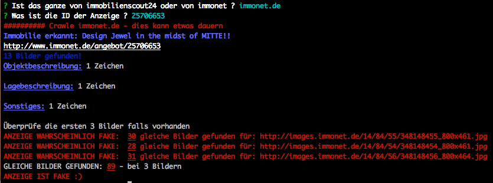
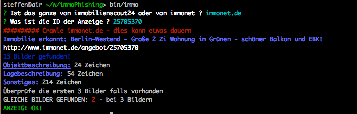

### immonet.de + immobilienscout24.de - Fake ad detector

CLI Tool that crawls immonet.de and immobilienscout24.de, gets the descriptions and compares the images with google images for similar images. `This is a proof of concept - nothing more

Usage

`npm i steffenmllr/immophishing -g`
`immophishing`

Select immonet.de, immobilienscout24.de is not implemented.

Follow the instructions.

